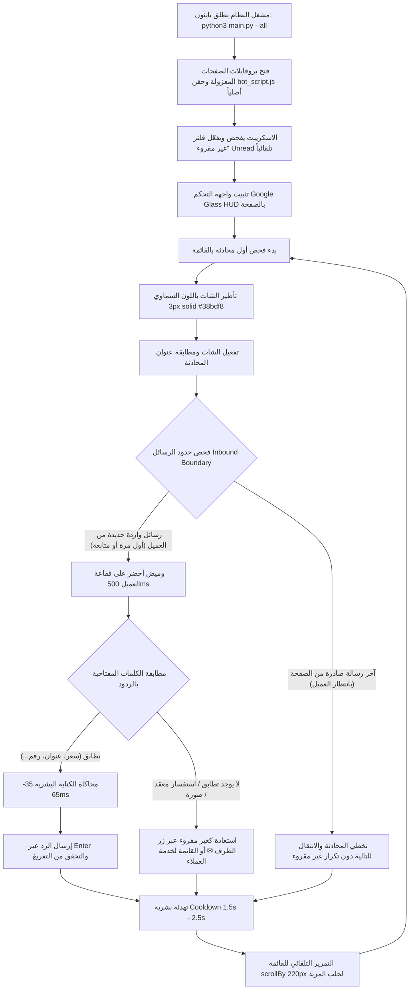

# أتمتة صندوق بريد Meta Business Suite & استعادة غير مقروء (الإصدار المؤسسي V6.3.7)
### Meta Business Suite Inbox Auto-Responder & Unread Restorer (Enterprise V6.3.7)
> نظام أتمتة مؤسسي متكامل لإدارة وتدقيق صندوق رسائل **Meta Business Suite** (صفحات فيسبوك وإنستغرام) عبر لغة **Python** ومحرك **Playwright** بالحقن الأصلي المباشر (Zero-Extension) بدون الحاجة لتثبيت أي إضافات متصفح، مع واجهة تحكم فاخرة بتصميم **Apple Prismatic Liquid Glass** عالي الشفافية، وآلية استعادة غير مقروء فائقة الموثوقية بفك تركيز المحادثة والتحقق التفاعلي، واستخراج أسماء العملاء المشدد، وتسمية موحدة للصفحات (Page ID).  
> **المسؤول التقني والمطور:** Bishoy Safwat (Senior Automation & Systems Engineer)

---

## 🌟 المزايا الكبرى في إصدار V5.0.0:
1. **آلية استعادة غير مقروء فائقة الموثوقية وفك مصيدة التركيز (Bulletproof Unread Restoration)**:
   - فك تركيز محرر الرسائل ومحتوى الشات تلقائياً (`releaseChatFocus`) قبل وبعد النقر لمنع Meta من إعادة تمييز المحادثة كمقروءة فوراً.
   - محاكاة نقر كاملة لكافة أحداث المؤشر والماوس (`dispatchFullClick`: pointerdown, mousedown, pointerup, mouseup, click).
   - حلقة تحقق تفاعلية متزامنة تنتظر حتى 1500ms لتأكيد ظهور العلامات البصرية (Blue Dot / Bold Text / Unread Tag).
   - إعادة محاولة تلقائية (Single Retry) عبر القائمة المنسدلة في حال عدم التأكيد في المحاولة الأولى.
2. **استخراج دقيق ومشدد لأسماء العملاء (Hardened Customer Name Extraction)**:
   - استبعاد صارم لأي سلاسل نصية تتجاوز 35 حرفاً.
   - استبعاد وفلترة فورية لأي نص يطابق فقاعات رسائل العميل المعروضة داخل نافذة المحادثة لمنع ظهور أجزاء من الرسالة كاسم للعميل.
3. **مزامنة وحفظ ذكي للإعدادات والقواعد (Debounced Config & Rules IPC)**:
   - حفظ فوري مباشر في `localStorage` مع تأخير ذكي (Debounce 400ms) لاستدعاءات IPC في بايثون لحماية المتصفح من إجهاد التخزين.
4. **تسمية موحدة ومطورة للصفحات (Page ID)**:
   - تحديث واجهة المستخدم وسجلات النظام لتعتمد مسمى `Page:` و `Page ID` بدلاً من `Tenant`.
5. **واجهة Apple Prismatic Liquid Glass السائلة فائقة الشفافية**:
   - تصميم زجاجي سائل عالي الشفافية بتدرج انكساري وتأثير بلوري عميق `blur(28px) saturate(200%)` مع كبسولات إبراز زجاجية سائلة للمحادثة ورسالة العميل.
   - حقل مفرد دقيق لسرعة الكتابة (مللي ثانية/حرف) وحقول عشرية بالثواني لفترات التهدئة.
6. **التشغيل النقي بدون إضافات (Zero-Extension Architecture)**:
   - حقن أصلي دائم للمحرك `bot_script.js` عبر Playwright دون الحاجة لإضافة Tampermonkey.
   - دعم كامل لأنماط التشغيل: الربط بالمتصفح النشط (`--attach`)، البروفايل المستقل (`--profile`)، والتشغيل المتزامن (`--all`).

---

## 📋 السيناريو الكامل لطريقة العمل (End-to-End Scenario)

يعمل النظام وفق سيناريو تشغيلي احترافي دقيق مصمم خصيصاً لخدمة العملاء وفرق المبيعات والكول سنتر:



### خطوات السيناريو بالتفصيل:
1. **التهيئة وقفل فلتر غير مقروء تلقائياً**:
   - يقوم السكربت تلقائياً بفحص شريط الفلاتر في Meta Business Suite؛ وإذا لم يكن فلتر **"غير مقروء" (Unread)** مفعلاً، يقوم بالنقر عليه وتفعيله فوراً وتثبيته في كل دورة.
   - يعالج السكربت حصرياً الرسائل غير المقروءة بالترتيب من الأعلى للأسفل.

2. **اختيار المحادثة والتأطير البصري (Step 1)**:
   - يختار الاسكريبت أول محادثة غير معالجة في القائمة دون قفز للفهرس.
   - يتم تأطير كارت العميل النشط فوراً ببرواز سماوي مضيء (`3px solid #38bdf8`) ليتابع المشغل خط سير العمل لحظة بلحظة.

3. **تفعيل المحادثة والتأكد من التحميل (Step 2)**:
   - يتم النقر على الكارت بمحاكاة نقر طبيعية.
   - ينتظر الاسكريبت تحميل الشات ويتأكد من مطابقة اسم العميل في العنوان قبل بدء القراءة.

4. **قفل الحدود ودعم أسئلة العميل المتتابعة (Step 3)**:
   - يفحص الاسكريبت المحادثة، ويحدد **آخر رد صادر من الصفحة**.
   - يجمع كل رسائل العميل التي وصلت **بعد** آخر رد صادر من الصفحة (سواء كانت رسالة أولى أو سؤالاً إضافياً لاحقاً مثل السعر، العنوان، أو التفاصيل).
   - **حماية المحادثات المكتملة (Inbound Guard)**: إذا كانت آخر رسالة في الشات صادرة من الصفحة بالفعل (العميل لم يرسل أي شيء جديد بعد ردنا)، يتخطى الاسكريبت المحادثة بأمان دون إعادة تمييزها كغير مقروءة حتى لا تظل عالقة في القائمة.

5. **الفحص البصري وتطابق الكلمات المفتاحية (Step 4)**:
   - يتم عمل وميض أخضر منقط (`2px dashed #22c55e`) لمدة 500ms على فقاعة رسالة العميل أثناء تقييمها.
   - تطبيع نصوص اللغة العربية بدقة (إزالة التشكيل، توحيد الألفات أ/إ/آ -> ا، التاء المربوطة ة -> ه، الألف المقصورة ى -> ي، والهمزات).
   - مطابقة الكلمات بأنواعها الثلاثة (`يحتوي`، `كلمة كاملة`، `مطابقة تامة`).

6. **تنفيذ مسارات القرار (Step 5)**:
   - **الفرع (A) في حالة التطابق**: 
     - التركيز على محرر الرسائل Lexical.
     - محاكاة كتابة النص حرفاً بحرف بسرعة بشرية متذبذبة (35ms - 65ms لكل حرف).
     - ضغط مفتاح Enter وزر الإرسال، والتأكد من تفريغ المربع.
   - **الفرع (B) في حالة عدم التطابق أو وجود صور/وسائط فقط (استعادة آمنة كغير مقروء)**:
     - لا يتم إرسال أي رد آلي عشوائي.
     - يتم استعادة المحادثة فوراً كـ **"غير مقروءة" (Unread)** عبر محدد الظرف المقاوم للأبعاد أو القائمة المنسدلة.
     - عزل خيارات الأرشفة (`نقل إلى المجلد "تم"`) تماماً.

7. **التهدئة والتمرير التلقائي ودورة الفحص من البداية (Step 6)**:
   - فترة تهدئة واستراحة بشرية عشوائية (1.5s - 2.5s).
   - التمرير السلس للأسفل (`scrollBy: 220px`) ثم العودة لأعلى القائمة بعد انتهاء غير المقروء.

---

## 📦 الحزم والمتطلبات البرمجية اللازمة

### 1. تثبيت الحزم عبر بايثون:
```bash
pip install -r requirements.txt --break-system-packages
```
*(أو `pip install playwright --break-system-packages`)*

### 2. متصفح Google Chrome:
يستخدم المحرك متصفح Google Chrome العادي المثبت على جهازك مباشرة (بدون تنزيل متصفحات إضافية لـ Playwright).

---

## 🚀 مشغلات الخوادم وأنماط التشغيل (Server Launchers & CLI Modes)

### 1. أنماط تشغيل بايثون المباشرة (`main.py`):
```bash
# النمط 1: تشغيل كافة الصفحات بالتزامن في بروفايلات معزولة (Default)
python3 main.py --all

# النمط 2: الربط بمتصفح Chrome المفتوح حالياً عبر منفذ CDP 9222
python3 main.py --attach

# النمط 3: تشغيل بروفايل محدد بعينه
python3 main.py --profile Profile_PageA

# خيارات إضافية:
python3 main.py --auto-start   # بدء الأتمتة فور تحميل الصفحة تلقائياً
python3 main.py --headless     # تشغيل بالخلفية بدون نافذة مرئية
```

### 2. بيئة لينكس (Ubuntu 24.04 LTS / Debian):
- **فحص الجاهزية والبيئة (Smoke Test):**
  ```bash
  ./launch_mbs_linux.sh --test
  ```
- **التشغيل المباشر لكافة الصفحات:**
  ```bash
  ./launch_mbs_linux.sh
  ```
- **الربط بالمتصفح النشط:**
  ```bash
  ./launch_mbs_linux.sh --attach
  ```
- **تسجيل الدخول الأولي لأحد البروفايلات:**
  ```bash
  ./launch_mbs_linux.sh --setup Profile_PageA
  ```

### 3. بيئة ويندوز (Windows 11 / Server):
- **الإعداد الآلي الشامل بنقرة واحدة (Zero-Touch Setup):**
  شغّل [`setup_windows_prerequisites.bat`](./setup_windows_prerequisites.bat) كمسؤول (Run as Administrator) لتهيئة خطة الطاقة والتحقق من بايثون وكروم.
- **التشغيل المباشر:**
  انقر نقراً مزدوجاً على [`launch_mbs_server.bat`](./launch_mbs_server.bat) لإطلاق المنظومة بالكامل.

### 4. أداة التدقيق والفحص الآلي الشامل (`audit_system.py`):
توفر المنظومة سكريبت فحص وتدقيق مستقل عالي الكفاءة (`audit_system.py`) للتحقق الشامل قبل النشر:
- التحقق من التطابق التام للملفات (UserScript 1:1 Parity).
- فحص قواعد منع التراجع (Anti-Regression Rules) لضمان عدم وجود أخطاء سابقة.
- التأكد من حقن Playwright الأصلي وإعدادات حماية بيئة Chrome.
- فحص بيئة التشغيل وحزم المتصفح وحالة مستودع Git.

```bash
# تشغيل التدقيق مباشرة:
python3 audit_system.py

# أو عبر مشغل لينكس:
./launch_mbs_linux.sh --test
```

---

## 🎮 التحكم في واجهة الـ HUD داخل المتصفح
- **التحريك بالسحب (Draggable)**: اسحب الشريط العلوي لأي مكان على الشاشة.
- **وضع الشبح (Ghost Mode 👻)**: يتحول إلى كبسولة مراقبة مصغرة (`100x32px`) خفيفة تعرض نبض الحالة وعدد الردود المنفذة بدقة وأناقة.
- **التصغير والتكبير (`—` و `⛶`)**: لتوسيع نافذة كتابة القواعد وتصفح السجلات.
- **إيقاف الطوارئ الفوري (<10ms)**: اضغط زر **[Escape]** في أي لحظة أو زر **⏹ إيقاف** في الواجهة أو **[Ctrl + C]** في الطرفية.

---

## 👨‍💻 المطور والمهندس المسؤول (Author & Engineering)
- **الاسم والمسؤول التقني:** بيشوي صفوت (Bishoy Safwat)
- **الدور:** Senior Automation & Desktop Systems Architect
- **حقوق الملكية والابتكار:** Designed & Engineered by Bishoy Safwat © 2026
