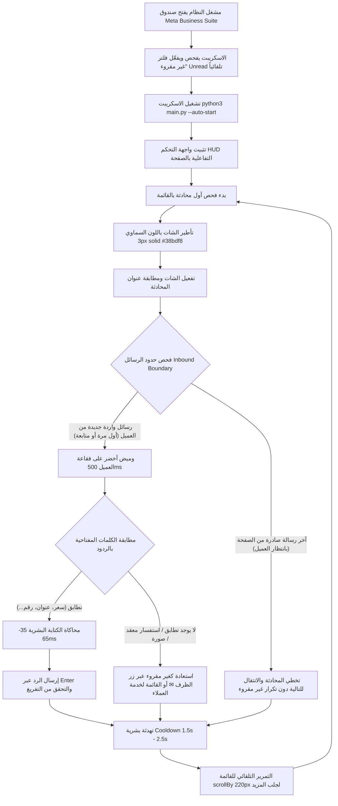

# ⚡ أتمتة صندوق بريد Meta Business Suite & استعادة غير مقروء (V4.4.2)
### Meta Business Suite Inbox Auto-Responder & Unread Restorer
> نظام أتمتة ذكي ومتكامل لإدارة صندوق رسائل **Meta Business Suite** (صفحات فيسبوك وإنستغرام) عبر لغة **Python** و **Playwright**، مع واجهة تحكم متطورة قابلة للتحريك والسحب (**Draggable**) وإعادة الحجم (**Resizable**) والتصغير للشريط المصغر (**Minimizable**) مدمجة داخل صفحة فيسبوك مباشرة.

---

## 📋 السيناريو الكامل لطريقة العمل (End-to-End Scenario)

يعمل النظام وفق سيناريو تشغيلي احترافي دقيق مصمم خصيصاً لخدمة العملاء وفرق المبيعات والكول سنتر:



### خطوات السيناريو بالتفصيل:
1. **التهيئة وقفل فلتر غير مقروء تلقائياً**:
   - يقوم السكربت تلقائياً بفحص شريط الفلاتر في Meta Business Suite؛ وإذا لم يكن فلتر **"غير مقروء" (Unread)** مفعلاً، يقوم بالنقر عليه وتفعيله فوراً وتثبيته في كل دورة.
   - يعالج السكربت حصرياً الرسائل غير المقروءة بالترتيب من الأعلى للأسفل.

2. **اختيار المحادثة والتأطير البصري (Step 1)**:
   - يختار الاسكريبت أول محادثة غير معالجة في القائمة دون قفز للفهرس.
   - يتم تأطير كارت العميل النشط فوراً ببرواز سماوي مضيء (`3px solid #38bdf8`) ليتابع المشغل خط سير العمل لحظة بلحظة.

3. **تفعيل المحادثة والتأكد من التحميل (Step 2)**:
   - يتم النقر على الكارت بمحاكاة نقر طبيعية.
   - ينتظر الاسكريبت تحميل الشات ويتأكد من مطابقة اسم العميل في العنوان قبل بدء القراءة.

4. **قفل الحدود ودعم أسئلة العميل المتتابعة (Step 3)**:
   - يفحص الاسكريبت المحادثة، ويحدد **آخر رد صادر من الصفحة**.
   - يجمع كل رسائل العميل التي وصلت **بعد** آخر رد صادر من الصفحة (سواء كانت رسالة أولى أو سؤالاً إضافياً لاحقاً مثل السعر، العنوان، أو التفاصيل).
   - **حماية المحادثات المكتملة (Inbound Guard)**: إذا كانت آخر رسالة في الشات صادرة من الصفحة بالفعل (العميل لم يرسل أي شيء جديد بعد ردنا)، يتخطى الاسكريبت المحادثة بأمان دون إعادة تمييزها كغير مقروءة حتى لا تظل عالقة في القائمة.
   - بمجرد أن يرسل العميل أي سؤال جديد، يلتقطه الاسكريبت فوراً ويقوم بالرد عليه.

5. **الفحص البصري وتطابق الكلمات المفتاحية (Step 4)**:
   - يتم عمل وميض أخضر منقط (`2px dashed #22c55e`) لمدة 500ms على فقاعة رسالة العميل أثناء تقييمها.
   - تطبيع نصوص اللغة العربية بدقة (إزالة التشكيل، توحيد الألفات أ/إ/آ -> ا، التاء المربوطة ة -> ه، الألف المقصورة ى -> ي، والهمزات).
   - مطابقة الكلمات بأنواعها الثلاثة (`يحتوي`، `كلمة كاملة`، `مطابقة تامة`).

6. **تنفيذ مسارات القرار (Step 5)**:
   - **الفرع (A) في حالة التطابق**: 
     - التركيز على محرر الرسائل Lexical.
     - مسح أي مسودة سابقة.
     - محاكاة كتابة النص حرفاً بحرف بسرعة بشرية متذبذبة (35ms - 65ms لكل حرف) مع وقفات طبيعية عند الفواصل والنقاط.
     - ضغط مفتاح Enter وزر الإرسال، والتأكد من تفريغ المربع.
   - **الفرع (B) في حالة عدم التطابق أو وجود صور/وسائط فقط (استعادة آمنة كغير مقروء)**:
     - لا يتم إرسال أي رد آلي عشوائي.
     - يتم استعادة المحادثة فوراً كـ **"غير مقروءة" (Unread)** عبر زر الظرف المباشر أو القائمة المنسدلة العلوية (`تمييز كغير مقروءة`).
     - **حماية تامة من الأرشفة**: تم عزل خيارات الأرشفة (`نقل إلى المجلد "تم"`) تماماً، وضمان النقر الحصري على "تمييز كغير مقروءة" فقط دون لمس مجلد "تم".

7. **التهدئة والتمرير التلقائي ودورة الفحص من البداية (Step 6)**:
   - فترة تهدئة واستراحة بشرية عشوائية (1.5s - 2.5s).
   - إزالة التأطير من الكارت.
   - فحص القائمة الجانبية: التمرير السلس للأسفل (`scrollBy: 220px`) طالما توجد محادثات تالية.
   - **العودة لأعلى القائمة (Loop from Top)**: عند الانتهاء من فحص كافة المحادثات غير المقروءة، يقوم الاسكريبت تلقائياً بالتمرير لأعلى القائمة (`scrollTo({ top: 0 })`)، والدخول في وضع المراقبة الذكية، ثم إعادة فحص المحادثات الجديدة الواردة بالترتيب المتسلسل الصارم من أول محادثة في الأعلى إلى الأسفل.
   - **التحقق من تبديل المحادثة (Active Chat Verification)**: التأكد التام من تطابق اسم العميل في الشات المفتوح مع البطاقة المحددة قبل فحص أي رسالة، لمنع قراءة أو تقييم محادثة مفتوحة مسبقاً عن طريق الخطأ.

---

## 📦 الحزم والمتطلبات البرمجية اللازمة

### 1. تثبيت الحزم عبر بايثون:
يجب تثبيت مكتبة `playwright`:
```bash
pip install playwright --break-system-packages
```

أو عبر ملف `requirements.txt`:
```bash
pip install -r requirements.txt --break-system-packages
```

### 2. متصفح Google Chrome:
لا يحتاج تنزيل متصفحات إضافية لـ Playwright، لأن الاسكريبت يتصل بمتصفح Chrome العادي المثبت على جهازك عبر منفذ التحكم عن بعد (`CDP`).

---

## 🚀 دليل التشغيل السريع

### الخطوة 1: تشغيل Google Chrome مع تفعيل منفذ التحكم (Port 9222)
أغلق جميع نوافذ Chrome تماماً، ثم شغّله من الطرفية (Terminal):

**على نظام لينكس (Linux):**
```bash
google-chrome --remote-debugging-port=9222
```

**على نظام ويندوز (Windows):**
```cmd
chrome.exe --remote-debugging-port=9222 --user-data-dir="C:\chrome-dev-profile"
```

### الخطوة 2: الدخول على صندوق الرسائل وتحديد فلتر غير مقروء
افتح الرابط في المتصفح:
`https://business.facebook.com/latest/inbox/`
وانقر على فلتر **"غير مقروء" (Unread)**.

### الخطوة 3: تشغيل اسكريبت بايثون
من مجلد المشروع:
```bash
python3 main.py --auto-start
```
*(أو `python3 main.py` والضغط على زر "▶ تشغيل الأتمتة" من داخل واجهة المتصفح).*

---

## 🪟 التحكم الكامل في واجهة الـ HUD (تحريك، تصغير، وتكبير)

1. **التحريك بالسحب (Draggable)**:
   - اضغط مع الاستمرار على الشريط العلوي للواجهة واسحبها لأي مكان تريده على الشاشة.
2. **التصغير (Minimize)**:
   - اضغط على زر التصغير (`—`) في الشريط العلوي لتتحول الواجهة إلى شريط مصغر أنيق يعرض الحالة والإحصائيات دون حجب الشات.
3. **التكبير (Maximize / Resize)**:
   - اضغط على زر التكبير (`⛶`) لتوسيع النافذة وكتابة القواعد والإعدادات بارتياح كامل.
   - يمكنك أيضاً سحب زاوية النافذة السفلية لتكبيرها أو تصغيرها بأي أبعاد.

---

## 🛑 إيقاف الأتمتة الفوري (Kill Switch)
- **من لوحة المفاتيح**: اضغط زر **[Escape]** في أي لحظة داخل المتصفح.
- **من واجهة الـ HUD**: اضغط زر **⏹ إيقاف (Esc)**.
- **من الطرفية (Terminal)**: اضغط **[Ctrl + C]**.

---

## 📤 الرفع على GitHub (Push to GitHub)

إذا كان لديك مستودع جديد على حسابك في GitHub، شغّل الأوامر التالية لرفع المشروع:

```bash
git remote add origin https://github.com/BishoySafwat01/<اسم_المستودع>.git
git branch -M main
git push -u origin main
```
